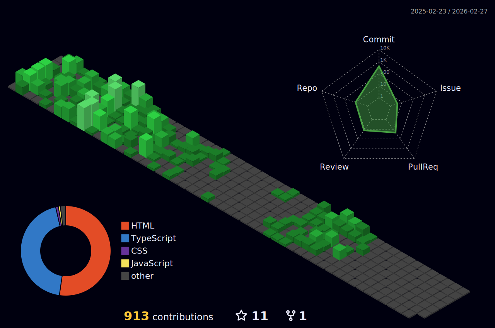

## Olá Visitante 👋

  
 |  |  |  
 | ----------- | ----------- |

  

   

# 💫 Sobre mim:
- 🎓 Formação: Estudante de Engenharia de Controle e Automação no IFSP.
- 💼 Atuação profissional: Analista de Sistemas e Controle Júnior.
- 💻 Tecnologias que utilizo:
  - Frontend: Next.js, React
  - Backend: Node.js
- 🚀 Interesses atuais:
  - Integração entre sistemas industriais e aplicações web
  - DevOps (CI/CD, Docker, GitHub Actions, AWS)
- 📚 Atualmente aprendendo:
  - Ferramentas e práticas de DevOps
  - .NET
  - Angular
  - AWS IoT  
  
🤝 <strong>Aberto a colaborações em projetos que unam automação industrial e desenvolvimento web.</strong>

## 🌐 Redes Sociais:
 
 

# 📊 GitHub Stats:

  

